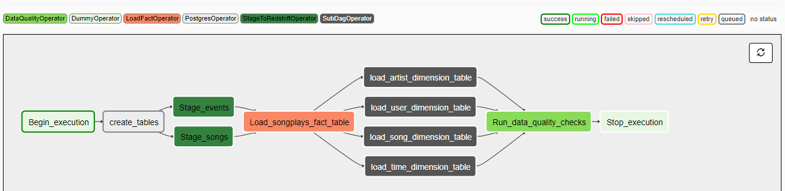

# PROJECT 5: DATA Pipelines

## Overview

A music streaming company, Sparkify, has decided that it is time to introduce more automation and monitoring to their data warehouse ETL pipelines and come to the conclusion that the best tool to achieve this is Apache Airflow.  

The goal of this project is  to create high grade data pipelines that are dynamic and built from reusable tasks, can be monitored, and allow easy backfills. They have also noted that the data quality plays a big part when analyses are executed on top the data warehouse and want to run tests against their datasets after the ETL steps have been executed to catch any discrepancies in the datasets.

The source data resides in S3 and needs to be processed in Sparkify's data warehouse in Amazon Redshift. The source datasets consist of JSON logs that tell about user activity in the application and JSON metadata about the songs the users listen to.

## Files and Datasets   

Data is grouped in two main datasets that reside in S3:   

- Song data
- Log data    

### Song dataset

The first dataset is a subset of real data from the Million Song Dataset. Each file is in JSON format and contains metadata about a song and the artist of that song. The files are partitioned by the first three letters of each song's track ID. For example, here is a filepath to to one file in this dataset.   `song_data/A/B/C/TRABCEI128F424C983.json`               
     
Below is an example of song data file content:    
 
``` json
{
    "num_songs": 1, 
    "artist_id": "ARJIE2Y1187B994AB7", 
    "artist_latitude": null, 
    "artist_longitude": null, 
    "artist_location": "",      
    "artist_name": "Line Renaud", 
    "song_id": "SOUPIRU12A6D4FA1E1", 
    "title": "Der Kleine Dompfaff", 
    "duration": 152.92036, 
    "year":0

} 
```    
### Log dataset

The second dataset consists of log files in JSON format generated by this  based on the songs in the dataset above. These simulate app activity logs from an imaginary music streaming app based on configuration settings.    

Example of what the data in a log file looks like. 

      

## Implementation steps    

Below are steps to follow to complete each component of this project.    

### Create Table Schemas  

Tables can be created directly in Redshift by executing create tables statements in `create_tables.sql` or by adding a task that runs   
after `Begin_execution` as shown in the workflow below.    

### staging the data and loadin dimension tables

This step is about load data from staging area into fact and dimension tables


### Data quality checks

In this step tables are checked if they contain records.

### DAG representing the workflow execution.    




Upon succesful completion, the five below tables will be created.         


Fact Table
  1. **songplays** - records in event data associated with song plays i.e. records with page NextSong     
   - songplay_id , start_time, user_id, level, song_id, artist_id, session_id, location, user_agent       
   
Dimension Tables
   1. **users** - users in the app
        - user_id, first_name, last_name, gender, level  
        
   2. **songs** - songs in music database
        - song_id, title, artist_id, year, duration
        
   3. **artists** - artists in music database
        - artist_id, name, location, lattitude, longitude
        
   4. **time** - timestamps of records in songplays broken down into specific units
        - start_time, hour, day, week, month, year, weekday      

        
###  Run the project

After the DAG is updated, run /opt/airflow/start.sh command to start the Airflow web server. Once the Airflow web server is ready, you can access the Airflow UI by clicking on the blue Access Airflow button.
